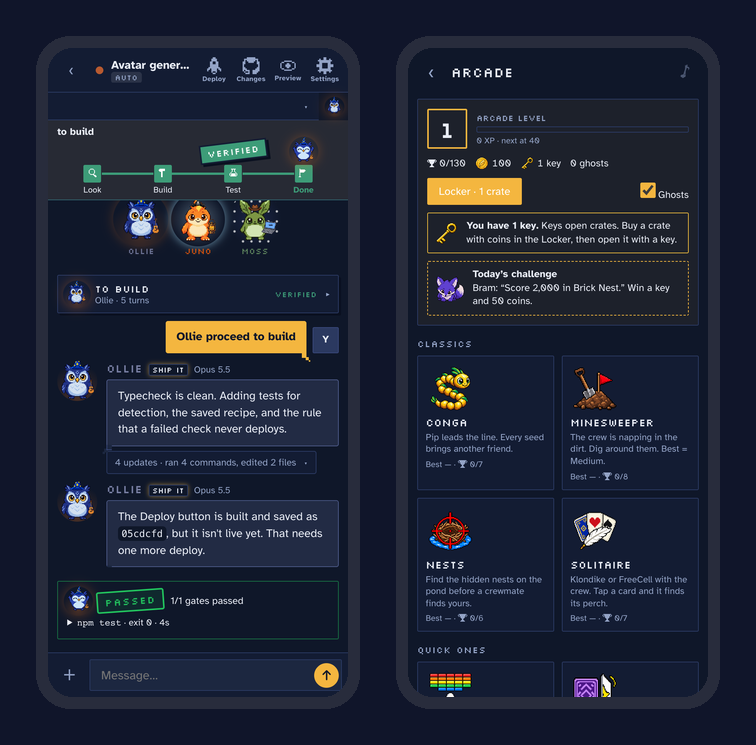

<p align="center">
  
</p>

<p align="center">
  <b>Drive Claude Code and Codex on your own computer — from your phone — through a crew of pixel-art birds.</b><br>
  Free &amp; open source · Mac, Windows, Linux · uses the plans you already pay for
</p>

<p align="center">
  
</p>

---

## Why Roost

Coding agents are amazing. Being chained to a laptop to babysit them isn't.

Roost runs on your computer and puts your agents in your pocket. You text the crew like a group chat. **Pip**, the dispatcher, hands each message to the right crew member — **Ollie** (Opus) for the hard problems, **Wren** (Sonnet) for everyday work, **Nell**, **Juno** and friends on Codex — and you watch the work happen: plan, build, test, verified, shipped. When they need a yes, your phone taps you. When they're done, the rocket lights up and you deploy with one tap.

It's built for the moments in between: in line for coffee, between meetings, on the couch.

<p align="center">
  
</p>

## What's inside

**A crew, not a chat log**
- Twelve pixel-art characters, each tied to a real model, with moods, energy, levels and a wardrobe they earn from real work.
- Every job reads like a story: a progress trail from *Plan → Review → Build → Test → Done*, a big **VERIFIED** stamp when the checks pass, and the crew cheering.
- "Where we left off" and "what's next" for every project, with one-tap **Continue**.

**Smart about your plan**
- Tell Roost whether you're on the $20, $100 or $200 plan and Pip hands out work to fit — and tells you when your week is running hot or cold.
- Per-project usage read from Claude's and Codex's own logs: *"yayo bay used 18% of your Claude week, mostly Ollie."*
- Plan mode, a second-opinion review from the other vendor, gates that actually run your tests, and approvals that never ask twice.

**Ship from your phone**
- Live preview of your app, git changes and history, and a Deploy button that waits for you when the checks pass.
- New project from the phone: folder, first commit and a GitHub repo in one tap.

**An arcade for the wait**
- 18 games — from Conga (Snake with the crew) to **Roost Birds** (a slingshot game with 45 hand-built levels), **Crew Kart** (a behind-the-kart racer) and **Bug Siege** (tower defense, crew as towers).
- Ghosts of each crew member to beat (Haiku's is easy, Astra's is not), a daily challenge, and **Roost Crates** — earn coins and keys, open crates, dress up your crew. No real money, ever.
- When a crew member needs you, the game pauses and a banner slides in. One tap to answer, one tap back.

<p align="center">
  
</p>

<p align="center">
  
</p>

## Install

You need **Node 20+**, **git**, at least one of **[Claude Code](https://docs.anthropic.com/en/docs/claude-code)** or **[Codex](https://github.com/openai/codex)** signed in, and **[Tailscale](https://tailscale.com/download)** (free) on your computer and your phone.

**Mac or Linux** — in Terminal:

```bash
curl -fsSL https://raw.githubusercontent.com/gjohnsonmb1-afk/roost/main/scripts/install.sh | bash
```

**Windows** — in PowerShell:

```powershell
irm https://raw.githubusercontent.com/gjohnsonmb1-afk/roost/main/scripts/install.ps1 | iex
```

The installer checks what's missing and walks you through it, builds Roost, starts it in the background (it comes back after a reboot) and ends on a **QR code** — scan it with your phone, then *Share → Add to Home Screen*.

Already cloned? Run `node scripts/setup.mjs` (or `--check` to just see what's missing).

**Updates:** Roost checks for new releases once a day and shows an *Update available* card with what changed. One tap installs it; if anything fails its checks, you stay on the version you had.

## What it costs

Nothing. Roost is free and open source (MIT). The agents run on **your own** Claude and/or Codex subscription — Roost never sees a bill, a key or your code.

## Privacy and security

- Everything runs on **your computer**. Your code never leaves it except to the model providers you already use.
- Your phone reaches it over **Tailscale**, a private network of just your own devices. Nothing is exposed to the internet.
- Roost runs commands on your machine by design, so keep it tailnet-only. Don't port-forward it.
- Approvals default to *ask first*. Full auto is a switch you flip on purpose.

## Known limits

- The computer has to be awake and online (on a Mac: `caffeinate -dimsu &` or [Amphetamine](https://apps.apple.com/us/app/amphetamine/id937984704)).
- Windows: signing in to Claude from the phone isn't supported yet — run `claude setup-token` on the computer. Windows is tested in CI on every commit, but it's the newest platform; [tell me](../../issues) if something's off.
- iPhone haptics use a Safari trick (iOS 18+). Older phones just don't buzz.

## For developers

```bash
npm install
npm run dev              # server with reload on :8790 + Vite on :5173
npm run typecheck && npm test
npm run service:install  # build, check, promote and (re)start the background service
```

```
phone browser ── Tailscale ──> Express + WebSocket server (server/)
                                 ├─ ClaudeAdapter: @anthropic-ai/claude-agent-sdk
                                 └─ CodexAdapter: `codex app-server` (JSON-RPC over stdio)
web/   React + Vite phone UI, the crew, the arcade
docs/  design notes, WINDOWS.md, ROADMAP.md
```

- Wire protocol: `server/src/protocol.ts` (mirrored in `web/src/types.ts`).
- CI runs install, typecheck, tests, a headless-Chrome smoke test and the background service on macOS, Windows and Linux.
- The full story of how it was built — every decision and why — is in [`ROADMAP.md`](ROADMAP.md).

## Troubleshooting

- **Phone can't connect** — check `tailscale status` on both devices; the computer must be awake.
- **Claude errors immediately** — make sure `claude` works on its own in that project folder first.
- **Codex stuck on "connecting"** — `codex login status`; run with `DEBUG_CODEX=1 npm start` to see raw traffic.
- **Anything else** — `node scripts/setup.mjs --check`, then [open an issue](../../issues).

## About

Built by **Garrett Johnson** — with a lot of help from the crew. If Roost made your day a little better, a ⭐ helps other people find it.

MIT licensed — see [LICENSE](LICENSE).
