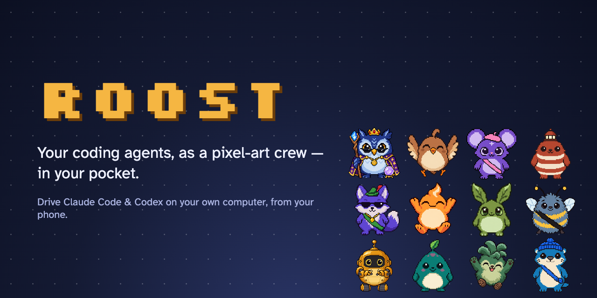
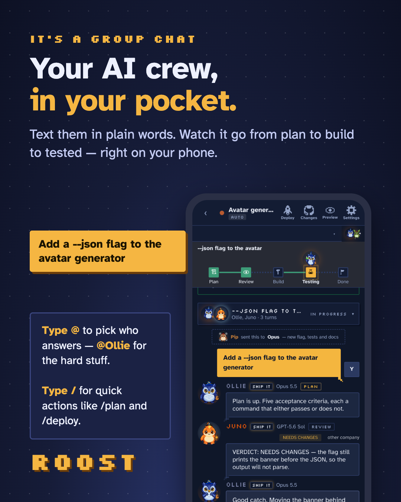
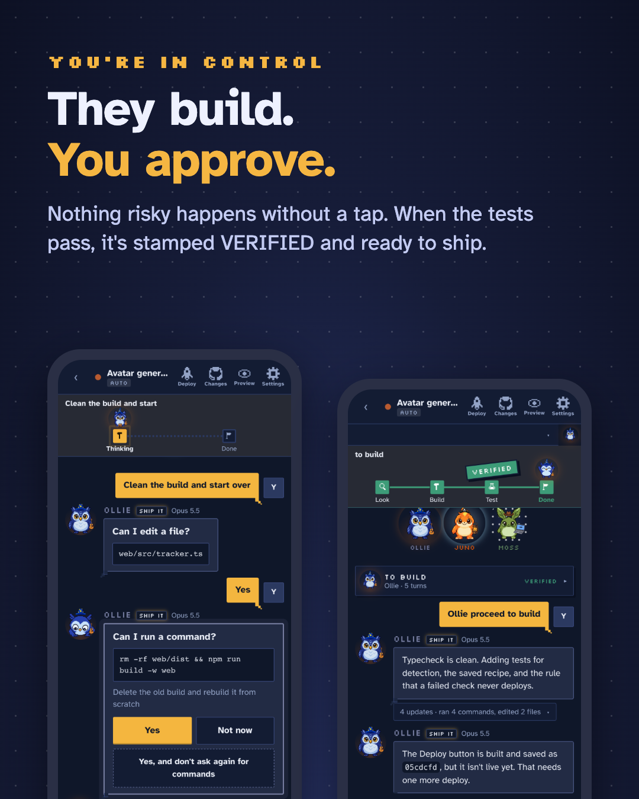
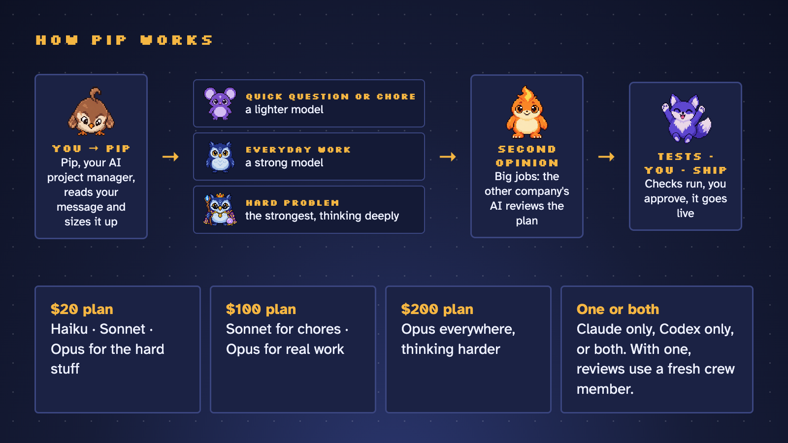
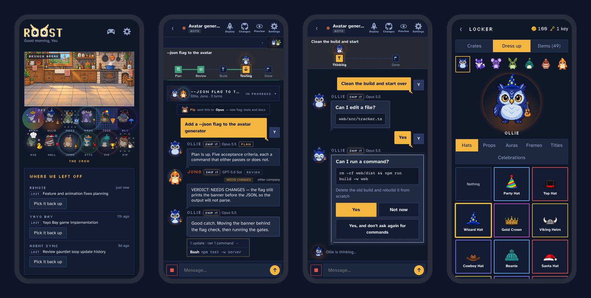
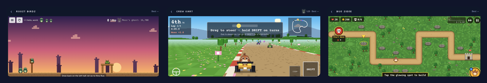

<p align="center">
  
</p>

<p align="center">
  <a href="https://github.com/gjohnsonmb1-afk/roost/actions/workflows/ci.yml"></a>
  <a href="LICENSE"></a>
</p>

<p align="center">
  <b>Stop babysitting your AI at your desk.</b><br>
  Roost turns Claude Code or Codex into a crew you text from your phone — and Pip, your AI project manager, sends every job to the right model.<br>
  Free &amp; open source · bring your own Claude or Codex plan · Mac, Windows &amp; Linux
</p>

<p align="center">
  <b>To install, just ask your AI:</b><br>
  <code>Install Roost from github.com/gjohnsonmb1-afk/roost</code><br>
  <sub>Paste that into Claude Code or Codex. It follows <a href="docs/INSTALL-WITH-AI.md">this guide</a> and only asks you for a couple of taps.</sub>
</p>

<p align="center">
  
</p>

<p align="center">
  <a href="docs/readme/roost-demo.mp4"><b>▶ Watch the 50-second demo</b></a> — a real job, from "add dark mode" to live, and Claude and Codex reviewing each other's plan.
</p>

---

## What is Roost?

AI coding agents like **Claude Code** and **Codex** can build real software — but you still sit at your desk and babysit them. Roost lets you run whole projects from your phone instead: it picks the right model for each job, waits for your *yes* before anything risky, and if you have both Claude and Codex, big jobs get a second opinion from the other one.

It runs quietly on your computer and turns your agents into a friendly crew you can text from your phone. You say what you want in plain words. They plan it, build it, test it, and check in with you before anything risky. You tap *yes*, and it ships.

<p align="center">
  
  
</p>

## How Pip works

**Pip** is your AI project manager. Every message goes to Pip first, who picks the right AI model for the job — a lighter one for quick questions, a strong one for everyday work, the strongest one thinking deeply for hard problems. On big jobs, the *other* company's AI reviews the plan before anything is built. Then the tests run, you approve, and it goes live.

<p align="center">
  
</p>

You don't need both Claude and Codex — either one works on its own. Tell Roost which plan you pay for ($20, $100 or $200) and Pip spends it wisely, and warns you when your week is running hot or cold.

## Benefits

- **Step away from your desk.** Start a job, go to lunch, approve it from your phone.
- **Get more from what you already pay for.** Pip matches each task to the right model and effort for your plan, and warns you when your week is running hot or cold.
- **Always on the newest models.** New Claude and Codex models show up on their own, set up the way their makers' docs recommend.
- **A second opinion built in.** On big jobs, one company's AI writes the plan and the other reviews it — you watch them talk it through.
- **Stay in control.** Nothing risky happens without your tap. Every job shows *Plan → Build → Test → Done*, and nothing is called done until the tests pass.
- **Private by design.** It runs on your computer. Your phone reaches it through Tailscale, a private network of just your devices.
- **Free and open source.** No accounts, no fees — you bring your own Claude or Codex plan. Roost never sees your code, keys or bill.

<p align="center">
  
</p>

## Talking to the crew

- **Just type.** Pip hands your message to the right crew member.
- **Type `@`** to pick who answers — `@Ollie` (Opus) for the hard stuff, `@Wren` (Sonnet) for everyday work, `@Nell` or `@Juno` on Codex.
- **Type `/`** for quick actions: `/plan` (plan first, nothing changes until you say go), `/deploy`, `/next` (what's left), `/pip` and `/help`.
- **Tap any face** to see who they are, how they're feeling, and what they're wearing.

## Features

**A crew, not a chat log**
- Twelve pixel-art characters, each tied to a real model, with moods, levels and a wardrobe they earn from real work.
- Every job reads like a story, with a big **VERIFIED** stamp when the checks pass.
- "Where we left off" and "what's next" for every project, with one-tap **Continue**.

**Claude and Codex, working together**
- Pip, the AI project manager, sends every message to the right crew member, model and effort.
- *Plan first* on big jobs: one company's AI writes the plan, the other pushes back, the first answers — and nothing is built until you tap Proceed.
- `@` anyone on the crew, Claude or Codex, from the same chat.

**Always current**
- Roost keeps Claude's and Codex's own software up to date, so new models appear by themselves.
- When a model is new, Roost reads its maker's official docs, applies the recommended effort for each kind of job, and shows you what changed — with a link to every source.
- Roost updates itself from tagged releases, with one tap, and rolls back if a new version fails its checks.

**Ship from your phone**
- Live preview of your app, git changes and history, and a Deploy button that waits for you when the checks pass.
- New project from the phone: a folder, first commit and GitHub repo in one tap.
- Per-project usage read from Claude's and Codex's own logs.

**And an arcade, for the wait**
- 18 small games starring the crew — including Roost Birds (a slingshot game with 45 levels), Crew Kart and Bug Siege.
- Ghosts of each crew member to beat, a daily challenge, and crates of hats and props for your crew. No real money, ever.
- When the crew needs you, the game pauses and a banner slides in.

<p align="center">
  
</p>

## Common questions

**Claude and Codex have their own phone apps now. Why this?** Those are great. Roost works with either or both, picks the right model for each job, runs your tests, waits for your approval, and keeps every project's progress in one place.

**Is it safe to run AI from my phone?** Roost runs only on your own computer and only answers your own devices, over Tailscale. It isn't on the internet, and risky steps wait for your tap.

**Am I approving code I can't read?** You see what changed, and the tests have already passed, before you tap yes. The full diff and history are one tap away.

**Will it burn through my plan?** It's built to do the opposite: small jobs go to lighter models, and Pip warns you when your week is running hot.

**Pixel art and games — is this a toy?** The crew makes it friendly. Underneath it's the real Claude Code and Codex, doing real work in your real repos.

**Does it break Anthropic's or OpenAI's terms?** It uses the official Claude Agent SDK and the official Codex app-server, signed in as you. No scraping, no shared accounts.

**Why Tailscale?** It's free, takes a couple of minutes, and it's what keeps Roost private to your own devices. The installer walks you through it.

**Is this maintained?** Yes. Releases are tagged, updates are one tap, and every change is tested on Mac, Windows and Linux. [Issues and ideas are welcome](../../issues).

## Install it yourself

Prefer to do it by hand? You need **Node 20+**, **git**, at least one of **[Claude Code](https://docs.anthropic.com/en/docs/claude-code)** or **[Codex](https://github.com/openai/codex)** signed in, and **[Tailscale](https://tailscale.com/download)** (free) on your computer and your phone.

**Mac or Linux** — in Terminal:

```bash
curl -fsSL https://raw.githubusercontent.com/gjohnsonmb1-afk/roost/main/scripts/install.sh | bash
```

**Windows** — in PowerShell:

```powershell
irm https://raw.githubusercontent.com/gjohnsonmb1-afk/roost/main/scripts/install.ps1 | iex
```

The installer checks what's missing and walks you through it, builds Roost, starts it in the background (it comes back after a reboot) and ends on a **QR code** — scan it with your phone, then *Share → Add to Home Screen*.

Already cloned? Run `node scripts/setup.mjs` (or `--check` to just see what's missing).

**Updates:** Roost checks for new releases once a day and shows an *Update available* card with what changed. One tap installs it; if anything fails its checks, you stay on the version you had.

## What it costs

Roost itself is free and open source (MIT). You bring the AI: it runs on **your own** Claude and/or Codex subscription — Roost never sees a bill, a key or your code.

## Privacy and security

- Everything runs on **your computer**. Your code never leaves it except to the model providers you already use.
- Your phone reaches it over **Tailscale**, a private network of just your own devices. Roost only accepts connections from your computer itself and your tailnet — not from the internet, and not from other people on the same Wi-Fi.
- Roost runs commands on your machine by design, so don't port-forward it. (On a trusted home network without Tailscale you can set `ROOST_ALLOW_LAN=1`, at your own risk.)
- Approvals default to *ask first*. Full auto is a switch you flip on purpose.

## Known limits

- The computer has to be awake and online (on a Mac: `caffeinate -dimsu &` or [Amphetamine](https://apps.apple.com/us/app/amphetamine/id937984704)).
- Windows: signing in to Claude from the phone isn't supported yet — run `claude setup-token` on the computer. Windows is tested in CI on every commit, but it's the newest platform; [tell me](../../issues) if something's off.
- iPhone haptics use a Safari trick (iOS 18+). Older phones just don't buzz.

## For developers

```bash
npm install
npm run dev              # server with reload on :8790 + Vite on :5173
npm run typecheck && npm test
npm run service:install  # build, check, promote and (re)start the background service
```

```
phone browser ── Tailscale ──> Express + WebSocket server (server/)
                                 ├─ ClaudeAdapter: @anthropic-ai/claude-agent-sdk
                                 └─ CodexAdapter: `codex app-server` (JSON-RPC over stdio)
web/   React + Vite phone UI, the crew, the arcade
docs/  design notes, WINDOWS.md, ROADMAP.md
```

- Wire protocol: `server/src/protocol.ts` (mirrored in `web/src/types.ts`).
- CI runs install, typecheck, tests, a headless-Chrome smoke test and the background service on macOS, Windows and Linux.
- The full story of how it was built — every decision and why — is in [`ROADMAP.md`](ROADMAP.md).

## Troubleshooting

- **Phone can't connect** — check `tailscale status` on both devices; the computer must be awake.
- **Claude errors immediately** — make sure `claude` works on its own in that project folder first.
- **Codex stuck on "connecting"** — `codex login status`; run with `DEBUG_CODEX=1 npm start` to see raw traffic.
- **Anything else** — `node scripts/setup.mjs --check`, then [open an issue](../../issues).

## About

Built by **Garrett Johnson** — with a lot of help from the crew. If Roost made your day a little better, a ⭐ helps other people find it.

MIT licensed — see [LICENSE](LICENSE).
